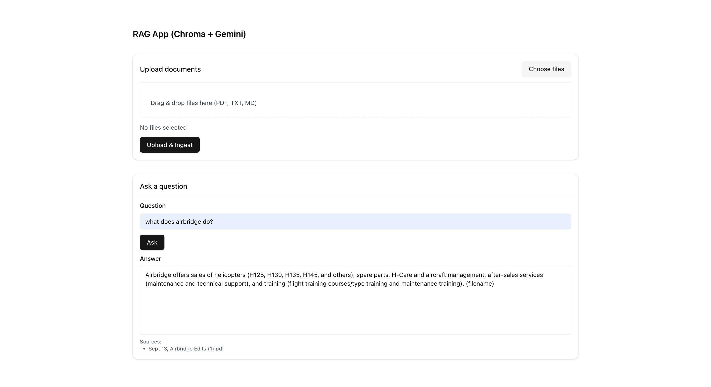

## RAG Application (LangChain + ChromaDB + Gemini)

Minimal Retrieval-Augmented Generation app using LangChain and ChromaDB with a simple CLI.

### Prerequisites
- Python 3.10+ (tested with Python 3.13)
- A Google Gemini API key

### Setup
1) Create and activate a virtual environment
```bash
python3 -m venv .venv
source .venv/bin/activate
```

2) Install dependencies
```bash
pip install -r requirements.txt
```

3) Configure environment
Create a file named `.env` in the project root:
```bash
echo "GOOGLE_API_KEY=your-gemini-api-key" > .env
```

### Ingest Data
Put your `.txt` files in the `data/` folder, then run:
```bash
python ingest.py --reset
```
This will chunk your text, create embeddings using `text-embedding-004`, and persist a Chroma DB in `chroma/`.

### Run the CLI
Ask a question with a query flag or interactively:
```bash
# One-off query
python app.py --query "What is LangChain?"

# Interactive prompt
python app.py
```

### Web UI (FastAPI)
Start the server and open the UI at http://127.0.0.1:8000
```bash
uvicorn server:app --reload
```
Use the input box to ask questions; answers and sources will appear below.

The app retrieves relevant chunks from Chroma, then calls `gemini-1.5-flash` to answer concisely, citing source filenames.

### Project Structure
```
.
├── app.py              # CLI RAG app (retriever + LLM)
├── ingest.py           # Ingestion pipeline to build Chroma vector store
├── requirements.txt    # Dependencies
├── .gitignore
├── data/               # Sample .txt data files
└── chroma/             # Persisted Chroma DB (created after ingestion)
```

### Example
After running ingestion, try:
```bash
python app.py --query "How does Chroma help in a RAG pipeline?"
```

### Notes
- Models used: `text-embedding-004` for embeddings, `gemini-1.5-flash` for answering.
- You can adjust chunking params in `ingest.py` and retriever `k` in `app.py`.

### Demo


Repository: [`hasnainkhan8532/RAG-App`](https://github.com/hasnainkhan8532/RAG-App.git)

### Web UI (Next.js + shadcn/ui)
Start API (required):
```bash
cd "/Users/hasnainayazmacbook/Desktop/RAG Application"
source .venv/bin/activate
uvicorn server:app --reload
```

Start frontend:
```bash
cd "/Users/hasnainayazmacbook/Desktop/RAG Application/web"
export NEXT_PUBLIC_API_BASE="http://127.0.0.1:8000"
npm run dev
```
Open http://localhost:3000


